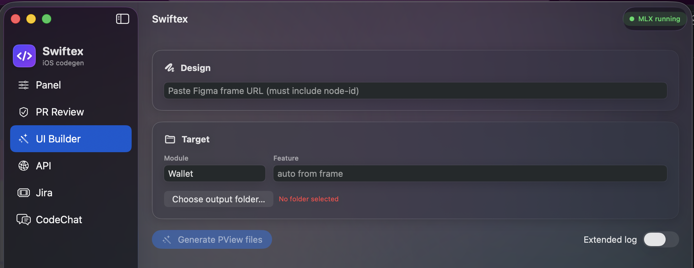
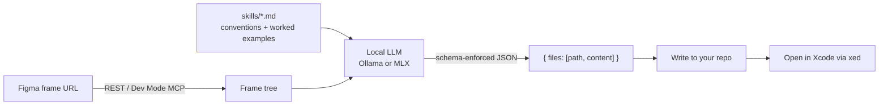

# Swiftex

A native macOS companion app for iOS development. Paste a Figma frame URL and it
generates Swift files (View / IO / ViewModel) using a **local LLM** (Ollama or
MLX) — then opens them in Xcode. No code ever leaves your machine.



🎬 [Watch the demo](demo/Swiftex-Demo.mp4)
https://github.com/aiProjectsByDhanajitKapali/swiftex/blob/main/demo/Swiftex-Demo.mp4

## What it does

| Tab | What it does |
|---|---|
| **UI Builder** | Figma frame → Swift view files, written to your repo and opened in Xcode |
| **PR Review** | Fetches a GitHub PR diff and reviews it with a strict, findings-only prompt |
| **API** | Paste a cURL → wires the endpoint into an existing ViewModel |
| **Jira** | Browse sprint tickets and pull context into generation |
| **CodeChat** | Ask questions about an indexed codebase (local RAG) or generate from chat |

## How it works

Swiftex holds **no UI knowledge** of its own. Everything about how code should be
written lives in editable markdown files under `skills/` — change the markdown,
change the output, no rebuild.



1. **Fetch** the selected Figma frame (REST API, or Figma Dev Mode MCP when available).
2. **Load skills** — markdown files describing your components, architecture, and a
   worked example the model mimics.
3. **Generate** — skills + frame tree go to the local model, which returns a
   schema-enforced JSON envelope of complete Swift files.
4. **Write & open** — files land under your chosen output root and open via `xed`.

Because the model writes the Swift (guided by the skills), output quality is only
as good as the skills — keep the worked examples exact and compilable.

## Requirements

- macOS 13+, Xcode 15+
- A local LLM backend, either:
  - [Ollama](https://ollama.com): `ollama serve && ollama pull qwen2.5-coder:14b`
  - MLX (Apple Silicon): managed in-app via `scripts/swiftex-mlx-serve.sh` on port 11435
- A Figma personal access token

Use a **coder** model (e.g. `qwen2.5-coder:14b`) — reasoning models burn their
token budget on hidden thinking and produce worse code here.

## Run

```bash
xcodebuild -project Swiftex.xcodeproj -scheme Swiftex -configuration Debug build
open build/Debug/Swiftex.app
```

Or open `Swiftex.xcodeproj` in Xcode and run the **Swiftex** scheme (⌘R).
The app is not sandboxed (it spawns `ollama`/`git`/`xed` and writes files you pick).

## Project layout

```
skills/                     # ALL generation knowledge (editable, no rebuild)
├── swiftex-skills/         # builder + verifier instructions
└── impl-skills/            # granular implementation skills (architecture, components, …)

Sources/Swiftex/
├── UI/                     # one view per sidebar tab
└── Core/                   # Ollama/MLX clients, Figma client, skill loader,
                            # prompt assembly, PR review, RAG index, shell exec
```

The skills folder is resolved from (1) a folder you pick in the Panel, (2) `./skills`,
or (3) the repo's `skills/`. Point it at your own repo's skills to make the output
match your codebase's conventions — that's the whole idea.
